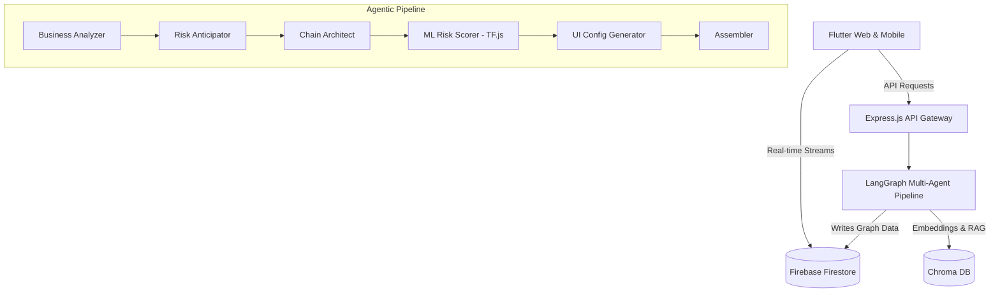

<div align="center">
  <h1>🌐 Resilia: Adaptive Supply Chain Platform</h1>
  <p>
    <b>An AI-powered, dynamic supply chain management application designed to map out, analyze, and self-heal complex global logistics networks in real-time.</b>
  </p>
  
  [](https://flutter.dev/)
  [](https://nodejs.org/)
  [](https://langchain.com/)
  [](https://js.tensorflow.org/)
  [](https://firebase.google.com/)
  [](LICENSE)
</div>

<br/>

## 📖 Overview

**Resilia** transforms how businesses manage and mitigate supply chain risks. By leveraging cutting-edge Agentic AI (LangGraph + LangChain) and an embedded ML Risk Model (TensorFlow.js), the platform intelligently generates feasible logistics networks from simple business ideas. It continuously scores geopolitical, climate, cyber, and transport risks, and autonomously recommends mitigation strategies using RAG (Retrieval-Augmented Generation) on customized disruption playbooks.

## ✨ Key Features

- 🧠 **Agentic AI Pipeline:** 6 specialized AI agents orchestrate the design, risk anticipation, and UI generation for the supply chain.
- 🔮 **Predictive Risk Modeling:** Custom TensorFlow.js neural network trained on supply chain data to forecast risks globally.
- ⚡ **Real-Time Synchronization:** Firebase Firestore and Server-Sent Events (SSE) provide instant UI updates across all connected devices.
- 🗺️ **Dynamic GIS Mapping:** Interactive map interface built with `flutter_map` offering live location tracking and risk zone visualization.
- 🛡️ **Self-Healing Logistics:** Disruption playbooks via a Vector Database provide intelligent, context-aware alternative routing.

## 🏗 Architecture

The platform operates on a decoupled, serverless-ready architecture optimized for real-time reactivity and AI inference.



## 🛠 Tech Stack

| Category | Technology |
| :--- | :--- |
| **Frontend** | Flutter (v3.5.0+), Provider, flutter_map, fl_chart |
| **Backend** | Node.js (TypeScript), Express.js, Server-Sent Events (SSE) |
| **AI / ML** | LangGraph, LangChain, TensorFlow.js, Gemini LLM |
| **Database** | Cloud Firestore (Real-time NoSQL), Chroma DB (Vector Search) |
| **DevOps & Cloud** | Docker, AWS Amplify (Frontend CI/CD), GCP Cloud Run (Backend) |

## 🧠 ML Risk Model

Our custom **TensorFlow.js** neural network provides highly accurate predictive risk scoring:
- **Architecture:** 3-layer neural network with ReLU activation and dropout regularization.
- **Features:** Analyzes node type, geographic coordinates, and industry category.
- **Output:** Outputs precise scores for Geopolitical, Climate, Cyber, and Transport risks.
- **Hybrid Approach:** ML predictions are fused with LLM assessments for a robust final risk report.

## 🚀 Getting Started

### Prerequisites
- Node.js (v18+) and npm
- Flutter SDK (v3.5.0+)
- Docker Desktop (Optional, for full containerized backend)

### 1. Environment Configuration
Create a `.env` file in the `backend/functions` directory:
```env
GOOGLE_GENAI_API_KEY="your_gemini_api_key_here"
LANGCHAIN_TRACING_V2=true
LANGCHAIN_API_KEY="your_langsmith_api_key"
LANGCHAIN_PROJECT="Resilia"
```

### 2. Run Backend
Install dependencies and train the model:
```bash
cd backend/functions
npm install
npm run train-model
npm run dev
```

### 3. Run Frontend
Launch the Flutter application pointing to your local API:
```bash
cd flutter_app
flutter clean
flutter pub get
flutter run -d chrome
```

## 🌍 Production Deployment

### Frontend (AWS Amplify)
The Flutter app is seamlessly deployed via **AWS Amplify**. A pre-configured `amplify.yml` exists at the root. Simply connect the repository in the AWS Console, and Amplify handles CI/CD globally via Amazon CloudFront.

### Backend (GCP Cloud Run / AWS ECS)
The backend is containerized for portability. 
1. Build the Docker image.
2. Push to Google Artifact Registry or Amazon ECR.
3. Deploy to **Google Cloud Run** or **AWS Fargate** for serverless, autoscaling AI execution.

## 📜 License
This project is licensed under the MIT License - see the [LICENSE](LICENSE) file for details.

<div align="center">
  <i>Built with ❤️ by an AI enthusiast.</i>
</div>
