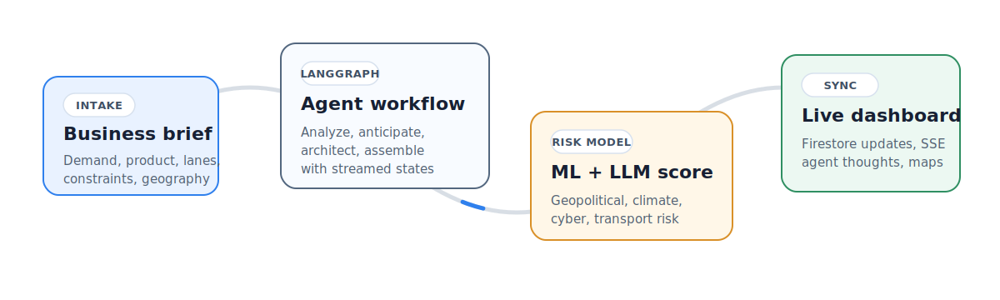
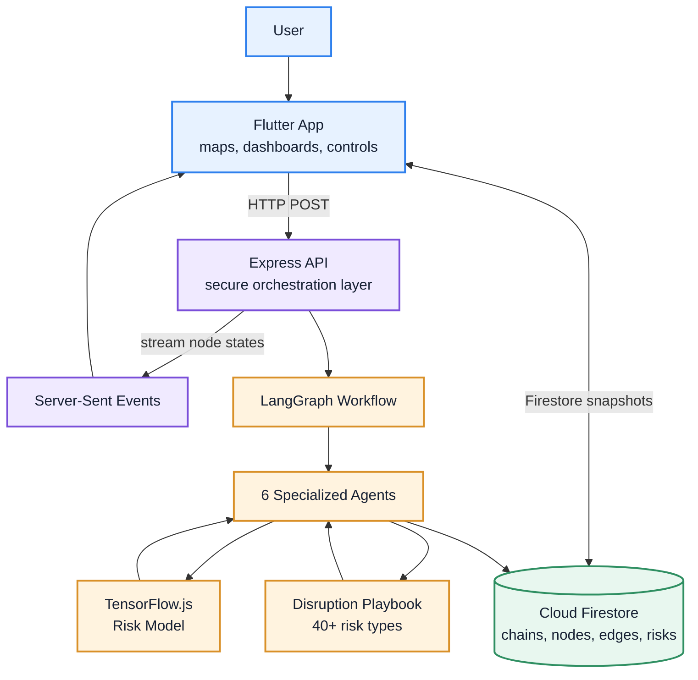
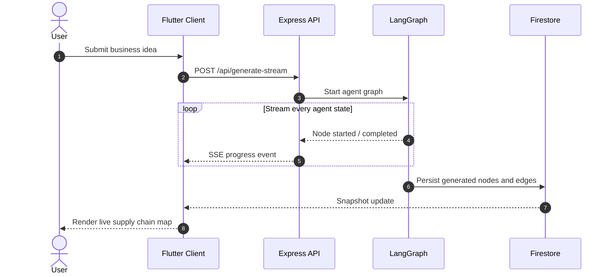
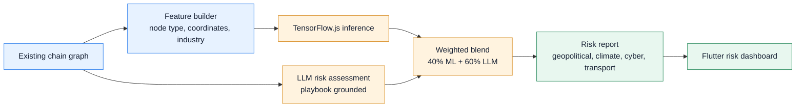
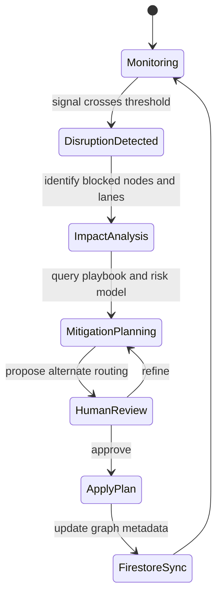
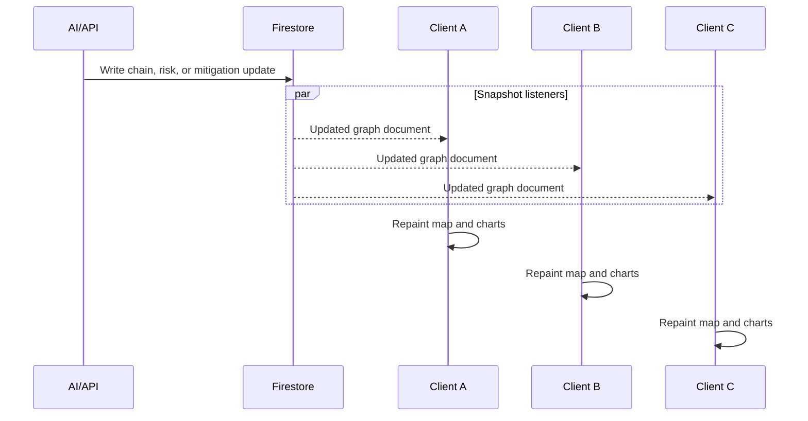
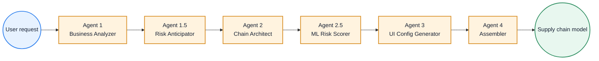
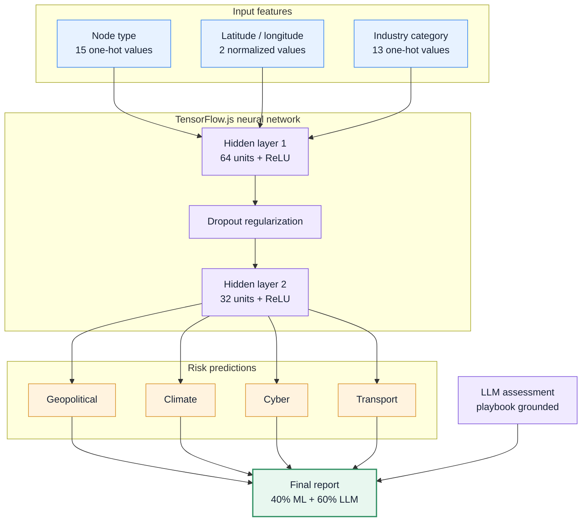
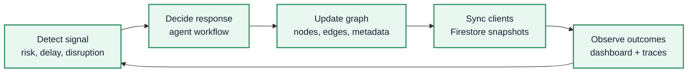
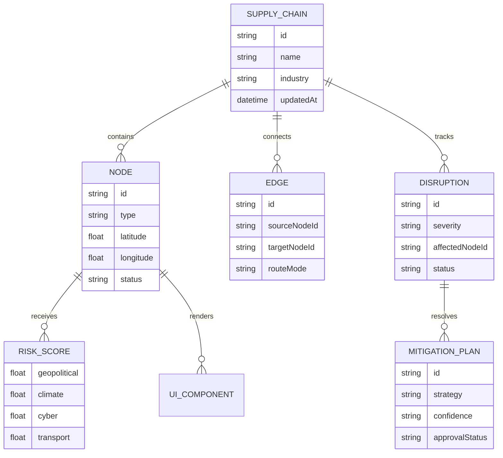

# Adaptive Supply Chain Platform (Resilia)


Resilia is an AI-powered dynamic supply chain platform for mapping, analyzing, and self-healing complex logistics networks. It combines a Flutter client, Firestore realtime synchronization, LangGraph multi-agent orchestration, and a TensorFlow.js risk model to turn a business brief into an inspectable supply chain graph with predictive disruption intelligence.



## Explore

- [System overview](#system-overview)
- [Interactive workflows](#interactive-workflows)
- [Agentic ML pipeline](#agentic-ml-pipeline)
- [Risk intelligence engine](#risk-intelligence-engine)
- [Realtime collaboration loop](#realtime-collaboration-loop)
- [Tech stack](#tech-stack)
- [API surface](#api-surface)
- [Data model](#data-model)

## System Overview



Resilia uses a decoupled realtime architecture:

| Layer | Responsibility | Key Technologies |
|---|---|---|
| Client | User interaction, maps, graph exploration, live AI progress | Flutter, Provider, `flutter_map`, `fl_chart` |
| API | Secure orchestration, streamed workflow execution, risk and mitigation endpoints | Node.js, TypeScript, Express.js, SSE |
| Intelligence | Multi-agent reasoning, disruption analysis, ML scoring, route planning | LangGraph, LangChain, TensorFlow.js |
| Data | Shared supply chain graph state and risk metadata | Cloud Firestore |
| Observability | AI traces and request logs | LangSmith, Winston, Morgan |

## Interactive Workflows

<details open>
<summary><strong>Workflow 1: Generate a supply chain</strong></summary>



</details>

<details>
<summary><strong>Workflow 2: Scan risk across the chain</strong></summary>



</details>

<details>
<summary><strong>Workflow 3: Self-heal a disruption</strong></summary>



</details>

<details>
<summary><strong>Workflow 4: Keep every client synchronized</strong></summary>



</details>

## Agentic ML Pipeline



| Agent | Purpose | Output |
|---|---|---|
| Agent 1: Business Analyzer | Converts the business idea into logistical components | Requirements, assumptions, operational scope |
| Agent 1.5: Risk Anticipator | Applies the disruption playbook before graph design | Macro-risk context and constraints |
| Agent 2: Chain Architect | Designs real-world nodes, routes, and coordinates | Supply chain graph draft |
| Agent 2.5: ML Risk Scorer | Runs TensorFlow.js inference on every node | Predictive risk scores |
| Agent 3: UI Config Generator | Builds dynamic node-page configuration | Dashboard-ready component metadata |
| Agent 4: Assembler | Merges all agent outputs into one model | Final enriched supply chain graph |

## Risk Intelligence Engine



The model is a 30 -> 64 -> 32 -> 4 neural network trained on 600+ synthetic samples derived from supply chain disruption knowledge. It scores four risk categories, then blends those scores with LLM assessment so the final report is both pattern-aware and context-aware.

## Realtime Collaboration Loop



## Tech Stack

| Area | Tools |
|---|---|
| Frontend | Flutter 3.5.0+, Provider |
| Realtime data | Firebase Firestore streams, Server-Sent Events |
| Maps and GIS | `flutter_map`, `latlong2`, `geolocator`, `geocoding` |
| Charts and UI motion | `fl_chart`, `shimmer`, `flutter_staggered_animations` |
| Backend | Node.js, TypeScript, Express.js |
| AI orchestration | LangGraph, LangChain |
| ML inference | TensorFlow.js |
| Knowledge base | Disruption playbook with 10 sections and 40+ risk types |
| Observability | LangSmith, Winston, Morgan |
| Database | Cloud Firestore |

## API Surface

| Endpoint | Purpose | Realtime behavior |
|---|---|---|
| `POST /api/generate-stream` | Generates a supply chain from a business prompt | Streams LangGraph progress via SSE |
| `POST /api/chains/:id/risk-scan` | Evaluates geopolitical, climate, cyber, and transport risk | Persists updated risk metadata to Firestore |
| `POST /api/chains/:id/disruptions/resolve` | Proposes mitigation plans and alternate routing | Updates the live chain graph after approval |

## Data Model



## Suggested Project Structure

```text
resilia/
  app/
    lib/
      features/
      maps/
      dashboards/
  api/
    src/
      routes/
      workflows/
      agents/
      risk/
  shared/
    schemas/
    playbooks/
  docs/
    diagrams/
```

## Why This Architecture Works

- Streaming keeps users inside the generation process instead of waiting on a black-box AI response.
- Firestore snapshots make generated chains collaborative across every connected client.
- The ML model provides fast, repeatable node-level risk estimates.
- The LLM agents add context, mitigation reasoning, and playbook-grounded tradeoff analysis.
- The architecture separates mobile UI, orchestration, intelligence, and persistence so each layer can evolve independently.
