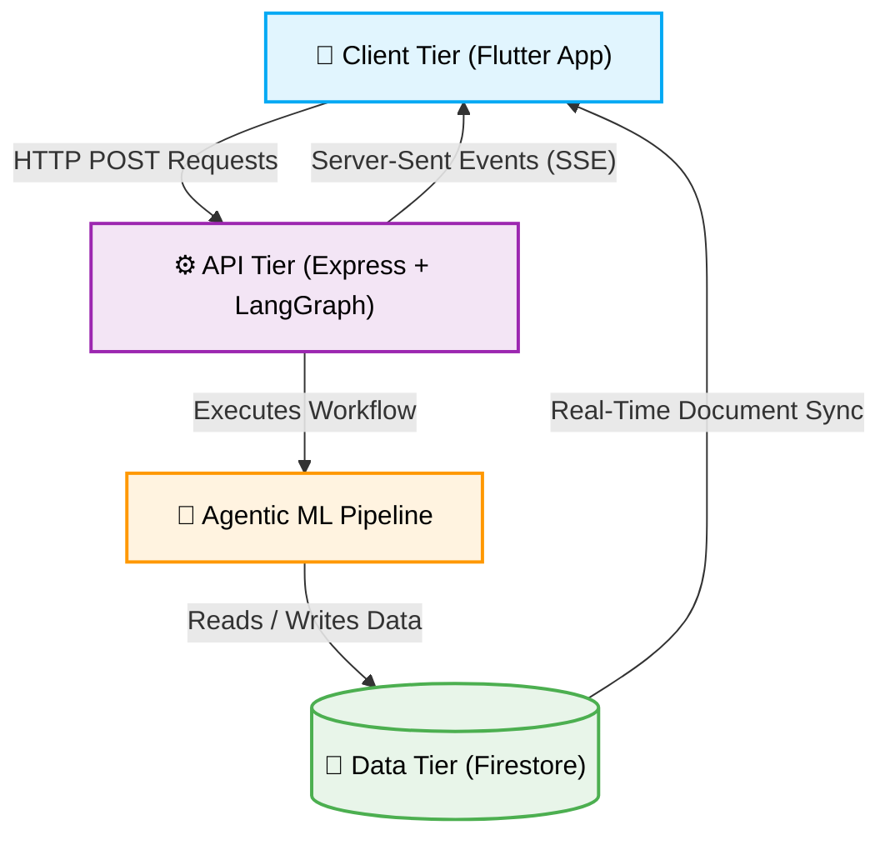
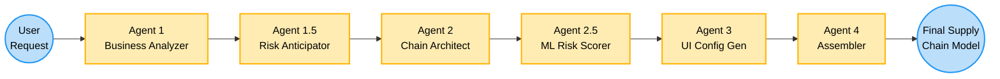
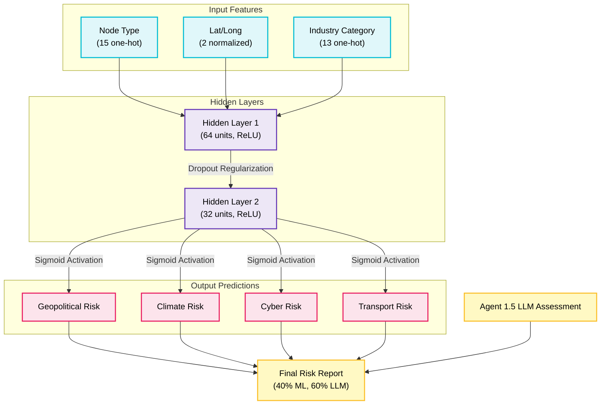

An AI-powered dynamic supply chain management application designed to map out, analyze, and self-heal complex global and domestic logistics networks. It leverages **LangGraph** and **LangChain** for multi-agent orchestration, a **TensorFlow.js ML Risk Model** trained on supply chain domain knowledge for predictive risk scoring, and provides **Real-Time** dashboard synchronization across all connected clients.

---

## 🛠 Tech Stack

### **Frontend (Mobile & Web App)**
- **Framework:** Flutter (v3.5.0+)
- **State Management:** Provider
- **Real-Time Data:** Firebase Firestore Streams (Snapshots) and Server-Sent Events (SSE).
- **Mapping & GIS:** `flutter_map` with `latlong2`, `geolocator`, and `geocoding` for coordinate mapping and live location tracing.
- **UI & Animations:** `fl_chart` for data visualization, `shimmer` & `flutter_staggered_animations` for premium loading states.

### **Backend (Microservices & Agentic AI)**
- **Runtime:** Node.js (TypeScript) & Express.js.
- **Agentic Orchestration:** **LangGraph** and **LangChain** for multi-stage AI reasoning workflows with 6 specialized agents.
- **ML Risk Model:** **TensorFlow.js** neural network trained on synthetic supply chain risk data for predictive risk scoring (geopolitical, climate, cyber, transport).
- **Disruption Playbook:** Comprehensive knowledge base injected directly into LLM prompts for deterministic, full-context reasoning.
- **Observability:** LangSmith (for AI tracing), Winston & Morgan (for request logging).

### **Cloud & Infrastructure**
- **Database:** Cloud Firestore (NoSQL) for real-time synchronization of supply chains and risk data.

---

## 🏗 Architecture

The platform follows a decoupled, real-time architecture with an agentic ML pipeline:

1. **Client Tier (Flutter App):**
   Handles all user interactions, UI state, and mapping logic. The application connects to Firestore directly via `cloud_firestore` to receive **instant, real-time updates** when a disruption occurs or is resolved. It also consumes Server-Sent Events (SSE) to display the live thoughts of the AI during generation.

2. **API Tier (Express + LangGraph):**
   Acts as the secure middleware and orchestrator.
   - `POST /api/generate-stream` - Streams LangGraph node execution states back to the client using SSE.
   - `POST /api/chains/:id/risk-scan` - Evaluates geopolitical, climate, and cyber risks using a hybrid ML model + LLM agent system.
   - `POST /api/chains/:id/disruptions/resolve` - Proposes intelligent alternative routing (mitigation plans) using the disruption playbook and ML risk predictions.

3. **Data Tier (Firestore):**
   Stores the actual generated graphs (nodes/edges). Flutter listens to changes on these documents to achieve a real-time, multi-device synchronized experience.

---

## 🧠 Agentic ML Pipeline Workflow

The supply chain generation and risk scoring process is handled by a pipeline of 6 specialized agents.

- **Agent 1 — Business Analyzer:** Analyzes business idea into logistical components using Gemini LLM.
- **Agent 1.5 — Risk Anticipator:** Anticipates macro risks using the full disruption playbook (10 sections, 40+ risk types).
- **Agent 2 — Chain Architect:** Designs the supply chain graph with real-world nodes and coordinates.
- **Agent 2.5 — ML Risk Scorer:** Runs TensorFlow.js neural network inference to predict risk scores for each node.
- **Agent 3 — UI Config Generator:** Generates dynamic UI component configurations for each node page.
- **Agent 4 — Assembler:** Combines all agent outputs into the final supply chain with enriched metadata.

---

## 🔬 ML Risk Model Engine

The platform includes a trained **TensorFlow.js** neural network for predictive risk scoring. The risk scores are blended with the LLM assessments (40% ML, 60% LLM) for the final risk report.

- **Architecture:** 3-layer neural network (30 → 64 → 32 → 4) with ReLU activation, dropout regularization, and sigmoid output.
- **Training Data:** 600+ synthetic samples generated from the disruption playbook's domain knowledge, covering 35+ global risk zones.
